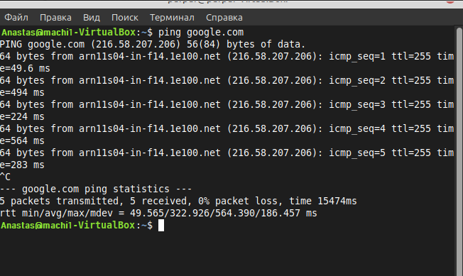
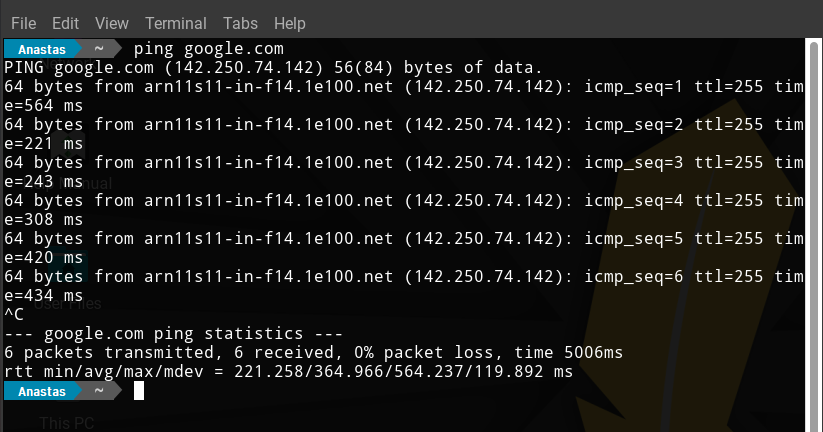
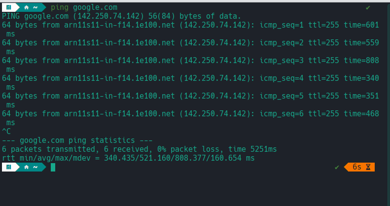
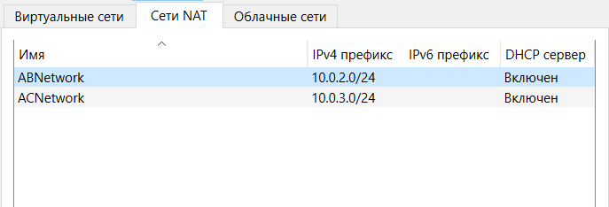
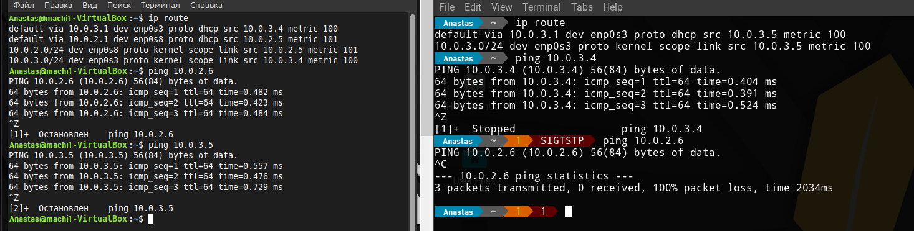
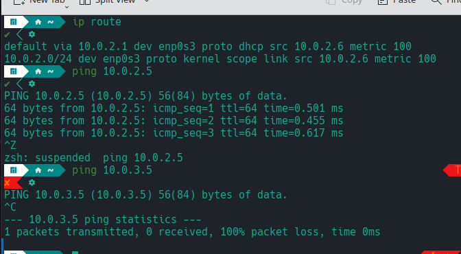

# Лабораторная работа 3

В данной лабораторной работе задача будет решена в ходе взаимодействия с терминалом и установления связи между несколькими виртуальными машинами.

# Задача

Необходимо настроить виртуальную машину А с Ubuntu (желательно, но можно и другую Linux подобную ОС) в VirtualBox. Обеспечить доступ в сеть Интернет. Осуществить проверку этого доступа и приложить скриншот из терминала. Следующим шагом настроить ещё одну виртуальную машину Б. После чего обеспечить сетевой доступ от машины А к машине Б. Приложить скриншот из терминала. Поднять ещё одну виртуальную машину В. Организовать сетевой доступ:

1. Из машины А в машину Б.
2. Из машины А в машину В.
3. Запретить доступ из машины Б в машину В.
4. Приложить скриншот, на котором видно терминалы всех трёх машин и видно что между машинами есть (или нет) доступа.

# Решение

Все три машины подключены к сети Интернет:

  

  

  

Теперь необходимо создать две сети (для A и B, для A и C):
Обязательно настроить IPv4 префикс!

  

Вот результат:

  

  

Как видно, все поставленные задачи выполнены. Машины А и B соединены, как и A с С, в то время как у B к C доступа нет.

