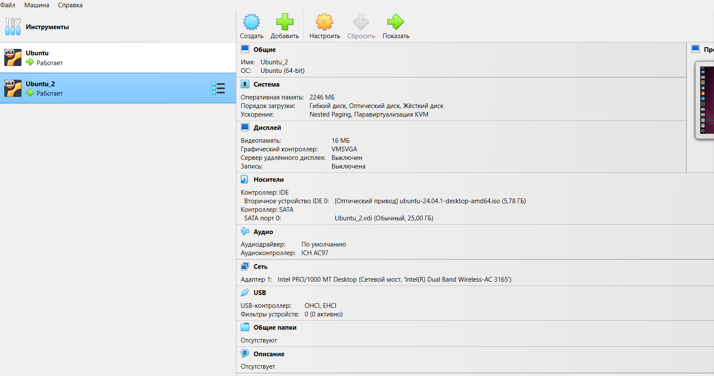
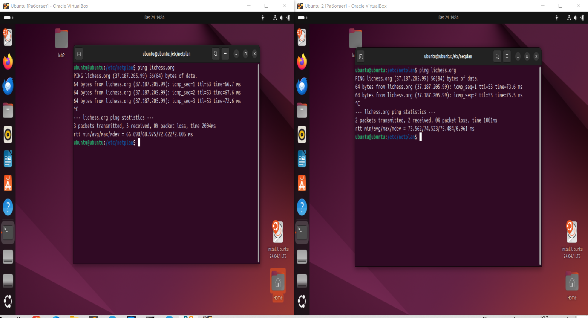
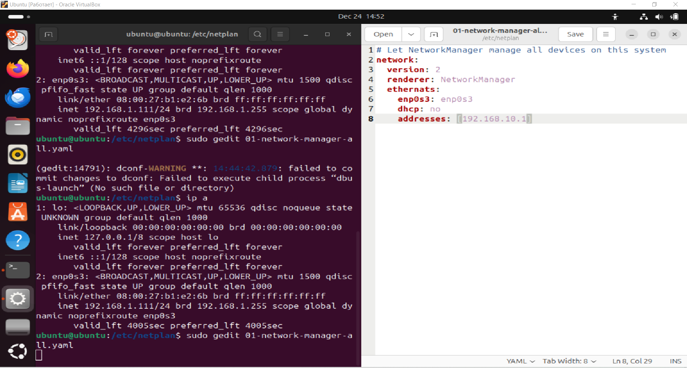

# Лабораторная работа 3

К сожадению, запустить 3 вирт машины одновременно у меня никак не получалось, поэтому я выполнил работу, используя только 2.

1. для начала создаем 2 вирт машины
   

     
   

2. проверяем доступ к сети у обеих
   

     
   

3. конфигурация ip:
   

     
   

   на одной машине установил 192.168.10.1, на другой – 192.168.10.2, однако результатов нет..
